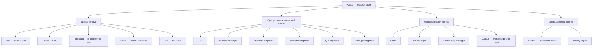

# Архитектура системы

## Принцип

Система строится вокруг [Алекса — Chief of Staff](%D0%90%D0%B3%D0%B5%D0%BD%D1%82%D1%8B/alex.md), который принимает задачу, выбирает нужного агента, собирает отчёты и держит общую картину.

## Контуры и срезы

- **Базовые контуры** (структура): бизнес-контур и продуктово-технический.
- **Сквозные срезы** (функциональные группировки): маркетинговый и операционный.
- Софья и Research Agent работают в нескольких срезах одновременно.

## Схема

## Маршрутизация задач

- Деньги, cash flow, дебиторка → [Света — CFO](%D0%90%D0%B3%D0%B5%D0%BD%D1%82%D1%8B/sveta.md)
- Продажи, CRM, сделки → [Тим — Sales Lead](%D0%90%D0%B3%D0%B5%D0%BD%D1%82%D1%8B/tim.md)
- Личный бренд, презентации, контент → [Софья — Personal Brand Lead](%D0%90%D0%B3%D0%B5%D0%BD%D1%82%D1%8B/sofya.md)
- E-commerce бутик, ассортимент, трафик → [Наташа — E-commerce Lead](%D0%90%D0%B3%D0%B5%D0%BD%D1%82%D1%8B/natasha.md)
- Тендеры → [Мира — Tender Specialist](%D0%90%D0%B3%D0%B5%D0%BD%D1%82%D1%8B/mira.md)
- HR и найм → [Оля — HR Lead](%D0%90%D0%B3%D0%B5%D0%BD%D1%82%D1%8B/olya.md)
- Контроль исполнения → [Никита — Operations Lead](%D0%90%D0%B3%D0%B5%D0%BD%D1%82%D1%8B/nikita.md)
- Архитектура и безопасность → [CTO](%D0%90%D0%B3%D0%B5%D0%BD%D1%82%D1%8B/cto.md)
- Требования и MVP → [Product Manager](%D0%90%D0%B3%D0%B5%D0%BD%D1%82%D1%8B/product-manager.md)
- Frontend → [Frontend Engineer](%D0%90%D0%B3%D0%B5%D0%BD%D1%82%D1%8B/frontend-engineer.md)
- Backend → [Backend Engineer](%D0%90%D0%B3%D0%B5%D0%BD%D1%82%D1%8B/backend-engineer.md)
- Тестирование → [QA Engineer](%D0%90%D0%B3%D0%B5%D0%BD%D1%82%D1%8B/qa-engineer.md)
- Деплой → [DevOps Engineer](%D0%90%D0%B3%D0%B5%D0%BD%D1%82%D1%8B/devops-engineer.md)
- Реклама → [Ads Manager](%D0%90%D0%B3%D0%B5%D0%BD%D1%82%D1%8B/ads-manager.md)
- Сообщество → [Community Manager](%D0%90%D0%B3%D0%B5%D0%BD%D1%82%D1%8B/community-manager.md)

## Связанные карты

- [00_Главная карта агентов](00_%D0%93%D0%BB%D0%B0%D0%B2%D0%BD%D0%B0%D1%8F%20%D0%BA%D0%B0%D1%80%D1%82%D0%B0%20%D0%B0%D0%B3%D0%B5%D0%BD%D1%82%D0%BE%D0%B2.md)
- [02_Карта скиллов](02_%D0%9A%D0%B0%D1%80%D1%82%D0%B0%20%D1%81%D0%BA%D0%B8%D0%BB%D0%BB%D0%BE%D0%B2.md)
- [Контуры/Бизнес-контур](%D0%9A%D0%BE%D0%BD%D1%82%D1%83%D1%80%D1%8B/%D0%91%D0%B8%D0%B7%D0%BD%D0%B5%D1%81-%D0%BA%D0%BE%D0%BD%D1%82%D1%83%D1%80.md)
- [Контуры/Продуктово-технический контур](%D0%9A%D0%BE%D0%BD%D1%82%D1%83%D1%80%D1%8B/%D0%9F%D1%80%D0%BE%D0%B4%D1%83%D0%BA%D1%82%D0%BE%D0%B2%D0%BE-%D1%82%D0%B5%D1%85%D0%BD%D0%B8%D1%87%D0%B5%D1%81%D0%BA%D0%B8%D0%B9%20%D0%BA%D0%BE%D0%BD%D1%82%D1%83%D1%80.md)
- [Контуры/Маркетинговый контур](%D0%9A%D0%BE%D0%BD%D1%82%D1%83%D1%80%D1%8B/%D0%9C%D0%B0%D1%80%D0%BA%D0%B5%D1%82%D0%B8%D0%BD%D0%B3%D0%BE%D0%B2%D1%8B%D0%B9%20%D0%BA%D0%BE%D0%BD%D1%82%D1%83%D1%80.md)
- [Контуры/Операционный контур](%D0%9A%D0%BE%D0%BD%D1%82%D1%83%D1%80%D1%8B/%D0%9E%D0%BF%D0%B5%D1%80%D0%B0%D1%86%D0%B8%D0%BE%D0%BD%D0%BD%D1%8B%D0%B9%20%D0%BA%D0%BE%D0%BD%D1%82%D1%83%D1%80.md)
