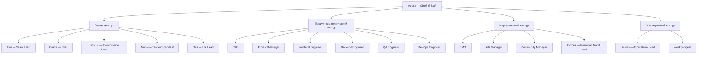

# Архитектура системы

## Принцип

Система строится вокруг [[alex|Алекса — Chief of Staff]], который принимает задачу, выбирает нужного агента, собирает отчёты и держит общую картину.

## Контуры и срезы

- **Базовые контуры** (структура): бизнес-контур и продуктово-технический.
- **Сквозные срезы** (функциональные группировки): маркетинговый и операционный.
- Софья и Research Agent работают в нескольких срезах одновременно.

## Схема

## Маршрутизация задач

- Деньги, cash flow, дебиторка → [[sveta|Света — CFO]]
- Продажи, CRM, сделки → [[tim|Тим — Sales Lead]]
- Личный бренд, презентации, контент → [[sofya|Софья — Personal Brand Lead]]
- E-commerce бутик, ассортимент, трафик → [[natasha|Наташа — E-commerce Lead]]
- Тендеры → [[mira|Мира — Tender Specialist]]
- HR и найм → [[olya|Оля — HR Lead]]
- Контроль исполнения → [[nikita|Никита — Operations Lead]]
- Архитектура и безопасность → [[cto|CTO]]
- Требования и MVP → [[product-manager|Product Manager]]
- Frontend → [[frontend-engineer|Frontend Engineer]]
- Backend → [[backend-engineer|Backend Engineer]]
- Тестирование → [[qa-engineer|QA Engineer]]
- Деплой → [[devops-engineer|DevOps Engineer]]
- Реклама → [[ads-manager|Ads Manager]]
- Сообщество → [[community-manager|Community Manager]]

## Связанные карты

- [[00_Главная карта агентов]]
- [[02_Карта скиллов]]
- [[Контуры/Бизнес-контур]]
- [[Контуры/Продуктово-технический контур]]
- [[Контуры/Маркетинговый контур]]
- [[Контуры/Операционный контур]]
